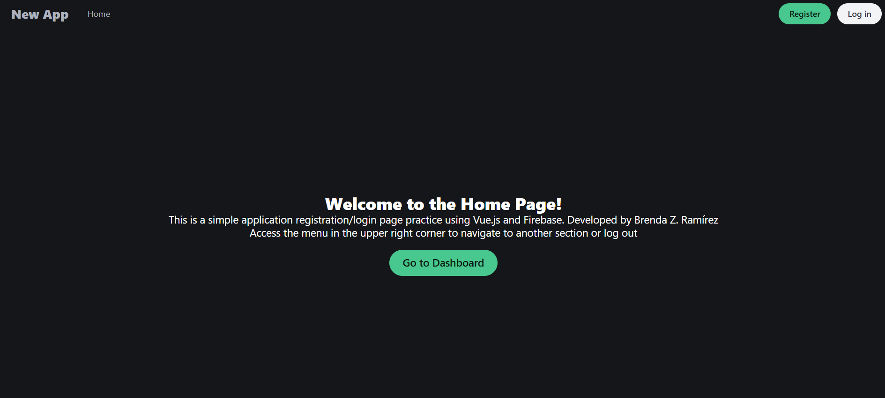
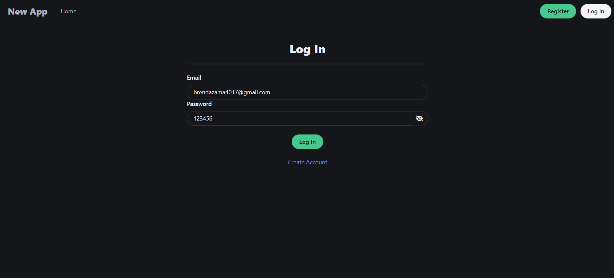
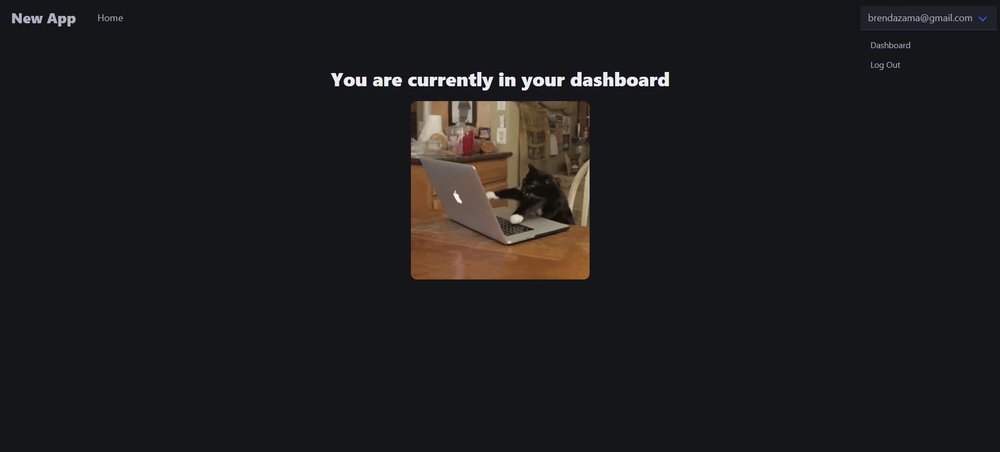

# Sistema Básico de Login y Registro

Esta es una aplicación web de gestión de sesiones que permite a los usuarios registrarse, iniciar sesión y acceder a un panel de usuario. Está construida con **Vue.js**, **Firebase** para la autenticación, y **SCSS** para los estilos.

## Descripción

La aplicación tiene como objetivo proporcionar un sistema sencillo y eficiente de autenticación de usuarios mediante un formulario de **login** y **registro**. Los usuarios pueden crear una cuenta, iniciar sesión y acceder a un panel personalizado donde se pueden gestionar las sesiones activas. Esta aplicación utiliza Firebase para manejar la autenticación y Vue.js para la interfaz de usuario.

### Características Principales:

- **Registro de usuarios**: Los usuarios pueden registrarse usando su correo electrónico y contraseña.
- **Inicio de sesión**: Los usuarios registrados pueden iniciar sesión y acceder a su cuenta.
- **Panel de usuario**: Después de iniciar sesión, los usuarios acceden a un panel donde pueden ver información personalizada.
- **Estilos responsivos**: La aplicación utiliza SCSS para un diseño limpio y responsivo.

## Funcionalidad de la Aplicación

### Página de Inicio

La página de inicio permite al usuario ver una introducción a la aplicación, con opciones para registrarse o iniciar sesión si ya tiene una cuenta.

### Registro de Usuario

El formulario de registro permite a los usuarios crear una nueva cuenta introduciendo su correo electrónico y contraseña. Una vez registrado, el usuario será redirigido al panel de usuario.

### Inicio de Sesión

Los usuarios que ya tienen una cuenta pueden iniciar sesión con su correo electrónico y contraseña. Si las credenciales son correctas, el usuario será redirigido a su panel de usuario.

### Panel de Usuario (Dashboard)

Una vez que el usuario inicia sesión correctamente, accede a su panel de usuario. Aquí puede gestionar su sesión y acceder a información relevante. Este panel muestra una vista personalizada según la cuenta del usuario.

## Tecnologías Utilizadas

- **Vue.js**: Framework JavaScript para construir la interfaz de usuario interactiva.
- **Firebase**: Servicio de backend para manejar la autenticación de usuarios.
- **SCSS**: Lenguaje de hojas de estilo para crear diseños responsivos y bien estructurados.
